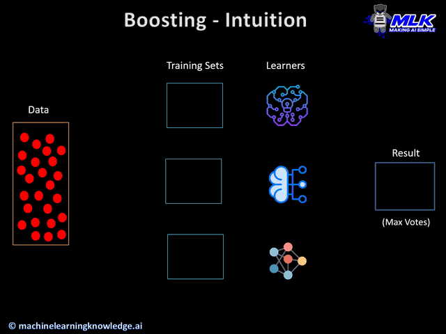
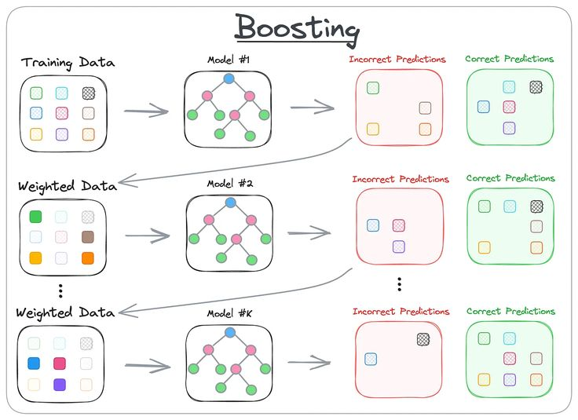

# ML1 | AdaBoost Classifier Analysis & Optimization

    

    

 

    
    
    
    

## Project Overview

In recent years, the rise of **Artificial Intelligence** and the widespread use of **Machine Learning** have revolutionized the way we tackle complex real-world challenges. However, due to the **diverse nature of data involved**, choosing the right algorithm is crucial to achieve efficient and effective solutions. Therefore, understanding the **strengths** and **weaknesses** behind different Machine Learning algorithms, and knowing how to **adapt them** to meet specific challenges, can become a fulcral skill to develop.

Furthermore, since the **choice of algorithm** greatly depends on the specific task and data involved, it's clear that there is no **"Master Algorithm"** (No algorithm can solve every problem). For example, while Linear Discriminants effectively delineate boundaries in data that is linearly separable, they struggle to capture relationships in more complex, higher-dimensional spaces.

This Project focuses on the following topic:

> With no Master Algorithm, is it possible to improve a existing Machine Learning Algorithm in characteristics it struggles the most?

Therefore, after choosing a **Machine Learning Algorithm** and gaining a thorough understanding of its theoretical and empirical aspects, we aim to **refine it**, specifically **targeting its weaknesses** in solving classification problems.

    

## Classifier Selection

Nowadays, since **singular Machine Learning Algorithms** can fall short to predict the whole data given, we decided to study an **Ensemble Algorithm**. Since these Algorithms can combine outputs of multiple models it makes them more prone to **better address more complex problems** and **provide better solutions**.

Consequently, after careful consideration, we decided to focus on enhancing the **AdaBoost Algorithm M1**, which is employed in **binary classification problems**.

<table width="100%">
  <tr>
    <td width="45%">
        

        <b>AdaBoost</b> (Adaptive Boosting) is a type of ensemble learning technique used in machine learning to solve both <b>classification</b> and <b>regression</b> problems. It consists on training a <b>series of weak classifiers</b> on the dataset. Therefore, with each iteration, the algorithm <b>increases the focus</b> on data points that were <b>previously predicted incorrectly</b>.
        

    </td>
    <td width="55%">
        

        

    </td>
  </tr>
</table>

As a result, the AdaBoost algorithm builds a model by considering all the individual **weak classifiers** which are **weighted based on their performance**. Consequently, classifiers with **higher predictive accuracy contribute more to the final decision** which **reduces the influence of less accurate ones** in the final prediction. 

## Authorship

- **Authors** &#8594; [Gonçalo Esteves](https://github.com/EstevesX10) and [Nuno Gomes](https://github.com/NightF0x26)
- **Course** &#8594; Machine Learning I [CC2008]
- **University** &#8594; Faculty of Sciences, University of Porto

<!--  -->

`README.md by Gonçalo Esteves`

